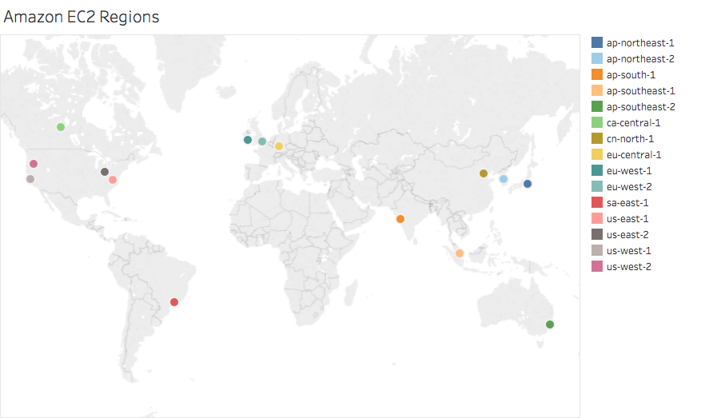
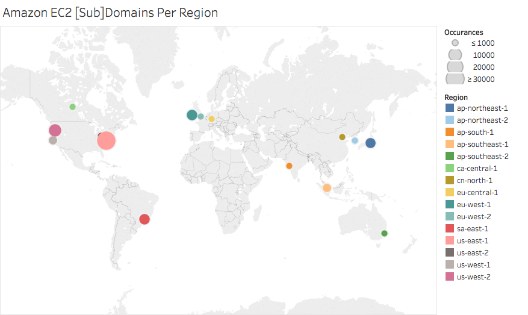

# Data Science Project: Web Service Deployment In EC2
### Pamela Needle and Francisco Flores
*Note: This is converted from .ipynb. To see intended formatting, see project.ipynb*


# I. Introduction


**Background**<br><br>
As technology progresses, we seem to be relying more and
more on these technological systems with our lives. A great exmample of this is
the idea of cloud computing. Businesses and consumers alike are beginning to
store all of their digital information within these clouds, as opposed to local
hard drives and/or servers. Big names in tech, such as Amazon, Google, and
Windows are taking advantage of cloud computing, offering their services as
cloud computing solutions. Industry claims that over 1% of Internet traffic goes
to Amazon's cloud computing service, Amazon EC2. As we know, technology is far
from perfect, and there always remains flaws within every system that can impact
a number of consumers and businesses depending on how heavily they rely on these
services. For instance, outages in Amazon EC2 are reputed to hamper a huge
variety of services. Our goal with this project is to determine who is currently
using EC2 Iaas Clouds, how these services are using the cloud, more
specifically, who is taking advantage of EC2's multiple region routing protocol,
and finally take our results and compare them to studies conducted in 2013 to
see what progress we have made towards the cloud, if any, and attempt to
predict, based on this trend, the future usage of cloud services.

**What is the
Cloud?**<br><br> 
The cloud refers to software and services that run on the
Internet, instead of locally on your computer. Some examples of cloud services
include Google Drive, Apple iCloud, Netflix, Yahoo Mail, Dropbox and Microsoft
OneDrive. These are examples of consumer cloud solutoions. The advantage of the
cloud is that you can access your information on any device with an Internet
connection. It’s what allows you to make edits to a file in Google Docs on your
home computer, and then pick up where you left off when you get to the office.
Colleagues can even collaborate on the same document. Business solutions include
Amazon Web Services, Windows Azure, and Rackspace, which basically do the same
thing, except provide businesses with a much larger amount of space to avoid
many pront end costs, such as buying servers.<br><br> 

**Infrastructure as a
Service (IaaS)**<br><br> 
The modernization of web services has recently been
increasingly pushing for deployment in infrastructure-as-a-service (IaaS) clouds
such as Amazon EC2, Windows Azure, and Rackspace. Infrastructure as a Service
(IaaS) is a form of cloud computing that provides virtualized computing
resources over the Internet, typically provided by a third-party provider hosts
hardware, software, servers, storage and other infrastructure components on
behalf of its users. IaaS providers also host users' applications and handle
tasks including system maintenance, backup and resiliency planning. <br><br>
**What is EC2?**  
Amazon Elastic Compute Cloud (Amazon EC2) is a web service
maintained by Amazon that provides secure, resizable compute capacity in the
cloud, and is usually known as the most popular IaaS cloud available. Amazon EC2
enables you to scale up or down to handle changes in requirements or spikes in
popularity, reducing your need to forecast traffic.
<br><br>

# II. Methodology

1. Get all possible subdomains of domains listed in Alexa's top 1m
2. Perform dns look ups using dig for all subdomains

## Data Acquistion

Amazon previously published "Alexa Top 1m Sites" which was a
list of the the top 1 million web site domains ordered by Alexa Traffic Rank.
This data used to be publically available, however, Amazon now charges a fee. We
will be working with the top 1m domains published in 2013 as a result. We
extraced a list of subdomains from a dataset derived from the Alexa's 2013 Top
1m domains that contains all subdomains for each domain in the top 1m
[http://pages.cs.wisc.edu/~keqhe/imc2013/Alexa_subdomain_dns_records.tar.gz].
Note: these are all subdomains from 2013 so we are going off the assumption that
these have remained the same. 


**GOAL: Our goal was to create a list of all
cloud-using subdomains which are associated with domains in Alexa's top 1m
sites. A subdomain is considered to be "cloud-using" if it has an IP address
that falls within Amazon's public IP address ranges. We are starting with a
dataset of subdomains that already fit this description, but because this was
generated in 2013, we must still reget all IP addresses and cross reference
against amazon IP ranges for these subdomains to get the current cloud-using
subdomains.**

We created a file called *uniquewithrank.txt* which is a list of
unique subdomain names and their associated ranking using the following command:  
```
$ awk -F'#' '!seen[$2]++ {print $1, $2}' ALL_subdomains_Alexa_top1m.csv > uniquewithrank.csv
```
    
The file *uniquewithrank.txt* contains a total of 34277354 subdomains.

    
### DNS Queries with 'dig'

In order to get the ip addresses associated
with each subdomain, we need to perform a DNS query on each subdomain that will
return its associated IP. Unix gives us the option to pick between 3 utilities
to perform these DNS queries, host, dig, and nslookup. We also look into using
ping to resolve IP addresses.  
    For this project, we came to the conclusion
that dig would be the most appropriate command for many reasons. For this
project, we have many entries that we need to query, so speed and efficiency of
the utility should be taken into account. Ping, in short, performs a DNS query
while also sending a message to that server to attempt to contact that server.
Dig simply returns the information about the server without trying to contact
it, which we do not need to do if we are simply resolving the IP of a domain.
Additionally, if we sent too many ping instances to a server, it could mistake
our queries for malicious activity and lock us out. In short, ping can be used,
but dig would be more appropriate. The nslookup utility was not used simply
because it has been depricated. Finally, host did pretty much the exact same
thing as dig, except the output was more user-friendly than raw, making it more
difficult to parse. Therefore, we shall use the dig utility. 


In order to perform the dns queries, we needed a file containing a subdomain to query on each line. We sorted the subdomains by increasing rank then extracted the subdomain names from the *uniquewithrank.csv* through the command:

    $ tail -n +2 uniquewithrank.txt | sort -n -k1 | cut -d " " -f 2- > uniqsortednameonly.txt

We passed this file as input to dig to perform DNS
lookups on each of the subdomains: 

    $ dig -f uniqsortednameonly.txt +noall +answer | awk '$4=="A" {print $1, $5}' > alldigresults.txt
    
The '+noall +answer' makes it so that only the answer is returned, and the rest of the
command parses the answer to only write the subdomain name along with the
associate IP address with it. 

The dig queries were the most time consuming
part of the data acquistion. Since a large amount of these subdomains did exist
in 2013, there was no way to tell if they still existed to this day. If the
subdomain did not resolve to an IP, it would try to dig for 10 seconds, dig's
default timeout, and return SERVFAIL. This started to add up after running dig
for approximately two weeks on the dataset, retrieving and storing our results
file called *alldigresults.txt*.   
<br>

### Manipulating Data 

We cleaned the
resulting file by sorting the subdomains in alphabetical order, removing the
added period at end of each subdomain name (as result of dig output), and
eliminated any repeated lines (instances where the distinct subdomain and ip
pair already exist within the file) and wrote this to a new file
*uniqdigresults.txt*. This was done using the following command: 

    $ sort -k1 alldigresults.txt | uniq | awk '{sub(/\.$/,"",$1);print $1, $2}' > uniqdigresults.txt
    


The total number of resulting lines (subdomain,ip)
were 2,519,088. Note: Subdomain names or IP addresses may be repeated within
these results, it is only the entire line itself that is unique.  We will
discuss later how we extracted the number of unique subdomains that are ALSO
present in Alexa's Top 1m.  The resulting file may, and most likely will,
contain subdomains that are not originally in our Alexa Subdomain list, as this
is a part of how the dig utility works; the returned answer to a dig query will
return all associated addresses for that (sub)domain. It is very possible that a
large number of subdomains now exist that did not exist when this list was
created in 2013. It is also possible that some of these subdomains do not exist
anymore, which returns a 'SYSFAIL' message.
<br>

#### How many subdomains from initial list did we query?
 In order to perform
any analysis on this data, we must know the total number of  number of Alexa's
Top 1m subdomains queried (as we could not query every subdomain in the starting
file due to time and space constaints). In order to extract a list of all unique
subdomain names queried we ran the following command on the unique dig results
file:

    $ sort -u -k1,1 uniqdigresults.txt > totalqueriedsubs.txt
    
Now we
need to make sure that each subdomain in this file is a valid subdomain (is
present in our initial subdomain list).  
<br><br>


From the
*totalqueriedsubs.txt* file, we filtered our subdomain names not present in our
original list in order to focus on subdomains that exist within the Alexa top 1
million by doing the following:
    1. Extract and sort subdomain names in the
first column of *totalqueriedsubs.txt*: 
    
        $ awk '{print $1}' totalqueriedsubs.txt | sort > tempnoperiod.txt

   2. sort the subdomain names from the previously made alexa subdomain name list *uniquesortednameonly.txt* and save to file  
    
       ```
       $ sort uniqsortednameonly.txt > uniqalexasubdomains.txt
       ```

    3. Extract all subdomains present in both sorted
files *tempnoperiod.txt* and *uniqalexasubdomains.txt*

        $ comm -1 -2 tempnoperiod.txt uniqalexasubdomains.txt > ALLqueriedalexasubdomains.txt  
        
From this new file *ALLqueriedalexasubdomains.txt*, we were able to tell that
1,490,155 of the 1,532,785 subdomains in *totalqueriedsubs.txt* were Alexa Top1m
subdomains. In total, there were 34,277,355 Alexa subdomain names in the
original dataset (from Aarons ALL_subdomains_Alexa_top1m.csv)

Therefore, we
queried approximately 4.5 percent of the total number of subdomains. However,
because we queried in order of ASCENDING ranking, our results still include the
most important subdomains/domain results.

#### Cross-referencing resulting IPs with Amazon EC2 IP Ranges

Using the dns
query results file dnsresults1.txt, we ran our python function
'crossref_subdomainip()' to cross reference each of these subdomain ip addresses
with amazons public ip ranges to see which subdomains used amazon ec2 :

```python
#from parser import crossref_subdomainip()
import parser
parser.find_ec2_subdomains() #write new file ec2cloudsubdomains.csv 

#This will create a file called 'ec2cloudsubdomains.csv'
```

This function yielded a new file *ec2cloudsubdomains.csv* with columns
rank,subdomain,subdomainip, and region.  
<br><br>
#### Finding Instances of Domains using Multiple EC2 Region Servers
Performing DNS queries produces
different results dependent upon your physical location. At a high-level, your
geographic location will determine where your traffic is sent, thereby
determining where your query is sent. So, for some examples, we may query a web
server in one location, and resolve to a completely different IP than in another
location, due to your traffic being forwarded to a physically closer server. In
an attempt to resolve subdomains to different IP addresses to see if these
subdomains are utilizing more than one EC2 region instance, we use an EDNS
query, which allows us to input a custom client IP subnet to designate where we
are performing a query from in attempt to produce different IP resolutions based
on geographical location We do this through the following commands:

    $ ./bin/dig/dig -f ALLqueriedalexasubdomains.txt +noall +answer +client | awk '$4=="A {print $1, $5}' > alldigresults.txt
    $ diff --new-line-format="" --unchanged-line-format="" <(sort alldigresults.txt) <(sort ALLqueriedalexasubdomains.txt) > new_IPs.txt

This command will perform the
patched dig function so that it has EDNS support, giving you the ability to
choose your client IP. For client subnet examples, we use the EC2 region address
ranges to query from different locations in the world. 
<br><br>

### Populate Database

We used posgresql database to organize our subdomain data.  Using this
file and the previously created *uniquewithrank.txt* file, we populated a psql
database. We created four tables "top1msubdomains" (a table derived from the
top1m subdomain csv file from Aaron's Dataset'), "top1msubdomains" (a table of
all subdomains in Alexas top 1m with an ip address that falls within one of
amazon's ip ranges), "cloudsubdomains" (a table of all subdomains that are an
instance of Amazon EC2), and "allqueriedalexadomains" (a table of ALL queried
alexa top 1m domains) by running the following commands in terminal:

    $ createdb alexadb
    $ psql alexadb -f create.sql

#### Determine Rank       
Now that we have a table of all the cloud-using
subdomains, we need to fill in the rank column. The resulting entries in the
*ec2cloudsubdomains.csv* file have rank values = 0 as the rank column defaults
to 0 and these values were then copied into our cloudsubdomains table. We
retrieved the correct rank associated with each subdomain through psql query :
```sql
UPDATE cloudsubdomains
SET rank = top1msubdomains.alexa_rank
FROM
top1msubdomains
WHERE top1msubdomains.subdomain=cloudsubdomains.subdomain;
UPDATE allqueriedalexasubdomains SET rank = top1msubdomains.alexa_rank FROM
top1msubdomains WHERE
top1msubdomains.subdomain=allqueriedalexasubdomains.subdomain;
```
  <br><br>
#### Create table of cloud using subdomains 
The current dnssubdomains table in
our database contains many subdomains that were not part of the intial Alexa
Top1m subdomain list due to how dig performs its queries. We created a new table
called *cloudsubdomains* that consists of only those subdomains in the dns query
results that are present in the original subdomain list. We did this through the
following query:

```sql
/*Delete entries in cloudsubdomains with rank=0 AKA
this would be the case when the subdomain was not in the alexa subdomain list*/
Delete from cloudsubdomains where cloudsubdomains.rank=0;
```
#### Create a list of domains in Alexa's top 1m that have cloud-using subdomains
Link each
subdomain with its domain to determine which domains in Alexa's top1m list have
cloud-using subdomains:
```sql
select csd.region, top.rank, top.domain,
csd.subdomain from cloudsubdomains csd, top1mdomains top 
where csd.rank =
top.rank group by csd.region, top.domain, csd.subdomain, top.rank order by
region, rank, domain;
```
<br><br>
#### Calculate number of subdomains for each domain
```sql
select csd.region, top.rank, top.domain, count(csd.subdomain) as
count 
from cloudsubdomains csd, top1mdomains top where csd.rank = top.rank
group by csd.region, top.domain, top.rank 
order by region, count, rank, domain;
```
<br><br>
#### Mapping Domains and Subdomain Counts to Region
```sql
with regions(region, rank, domain, num_subdomains) as 
(select csd.region, top.rank,
top.domain, count(csd.subdomain) as count 
from cloudsubdomains csd,
top1mdomains top where csd.rank = top.rank group by csd.region, top.domain,
top.rank 
order by region, count, rank, domain)
select region, count(*) as
domains, sum(num_subdomains) as subdomains from regions 
where region !=
'GLOBAL' and region != 'us-gov-west-1' group by region order by domains DESC,
subdomains DESC, region; 
```


We needed to perform additional queries to manipulate/organize the data
further.
First, we aggregated our results into a csv with headers for
rank,subdomain,subdomainip,region

```sql
\Copy (select * from dnssubdomains
where rank!=0) To '/vagrant/projectfrankiepam/finalresults.csv' With CSV
Delimiter ',';
```  
<br><br>

### Top 10 (by Alexa rank) EC2-using domains, their total number of subdomains, and the number of EC2-using subdomains

```sql
select rank,count(rank) from
cloudsubdomains group by rank order by rank ASC limit 10;
```


# III. Results

| Rank |       Domain       | # EC2 Subdomains | Total # subdomains queried |
|------|--------------------|------------------|----------------------------|
|   9  |     amazon.com     |  29              |                   29       |
|   36 |    fc2.com         |  18              |                   82       |
|   40 |    amazon.co.jp    |   5              |                    5       |
|   42 | ask.com            |   1              |                   28       |
|   48 | imdb.com           |   2              |                    2       |
|   60 | amazon.de          |   5              |                    10      |
|   76 | adobe.com          |   5              |                   24       |
|   79 | amazon.co.uk       |   7              |                    8       |
|   97 | huffingtonpost.com |   1              |                    1       |
|  105 | cnet.com           |   1              |                   24       |



### What percentage of alexa's top1m domains list have a subdomain thats cloud using?
In order to calculate the percentage of domains in Alexa's top 1 million
list have . asubdomain that uses EC2 (the cloud) we had to consider a smaller
subset of the top 1 million list. 

We performed the following queries in order
to calculate these statistics:

```sql
select count(distinct subdomain) from
allqueriedalexasubdomains;
  count  = 1490154
 
select count(distinct rank) from
cloudsubdomains;
 count = 3902
  
select count(distinct rank) from
allqueriedalexasubdomains;
 count = 82926
 
select count(distinct subdomain)
from cloudsubdomains;
 count = 37310

```

We found that 3,902 (~4.7%) of the
82,926 domains we queried in Alexas top 1m domains have a cloud-using subdomain.
Under these queried subdomains, we found a total of 37,310 cloud-using
subdomains.



# IV. Conclusions

Given the fact that the cloud has grown in popularity, we conducted this study
assuming that there will be a change in cloud-usage among popular sites.
Although performing dns queries on all of the subdomains in Alexa’s Top 1m list
was out of the scope of this project, we calculated our results based on the
number of subdomains we did query (1,490,154). Our calculations matched those
that were performed on the entire data set (approx. 4.7% of domains in the top
list had cloud-using subdomains). The pitfall with this is that we are using the
2013 Alexa Top1m list and associated domains. Therefore, we are not considering
any new subdomains for those domains that may now exist. For future studies, a
more recent Alexa Top1m list should be used and all subdomains should be
recalculated.

Based on the results of all EDNS queries, we can safely conclude that not much
has changed when it comes to EC2 routing when it comes to regions used. We found
that ~99% of our queried domains and subdomains utilize only one region when
routing traffic. This is not the best we can do, as Amazon EC2 allows their
users to route through multiple different regions. For future studies, I
believe that taking more Alexa data, such as majority location of traffic, and
conduct more locational studies, such as determining if nameserver location is
closest to the origin location of the majority of traffic, examination of EC2
deployment patterns such as Elastic Beanstalk(ELB, front end VM, and PaaS and
determine popular deployment patterns and make determinations onto how some of
these services can improve thier individual deployment pattern based on this
information. This would require more Alexa information, which now costs a fee.

# IV. Related Work

This project was adopted from a study conducted by Aaron Gember-Jacobson; Next
Stop, the Cloud: Understanding Modern Web Service Deployment in EC2 and Azure.
We used this paper as a model for our project and compared our results to his
results, which were taken in 2013, to see if any significant changes have been
made/noticed. This project was modified to fit within the scope of the Data
Science Course as well as modifying specific antiquated techniques, such as the
use of Planet Lab Nodes for geographical location DNS querying since Planet Lab
is currently deprecated. We replaced this technique with EDNS queries, providing
the same data. We also did not query as many subdomains, due to time
constraints, and focused on Amazon EC2, as opposed to EC2 and Windows Azure. We
felt as though trimming the section on how domains currently use Iaas was
necessary because if we went into as much detail, our entire presentation would
simply be defining network terms, deviating too far from the course.
